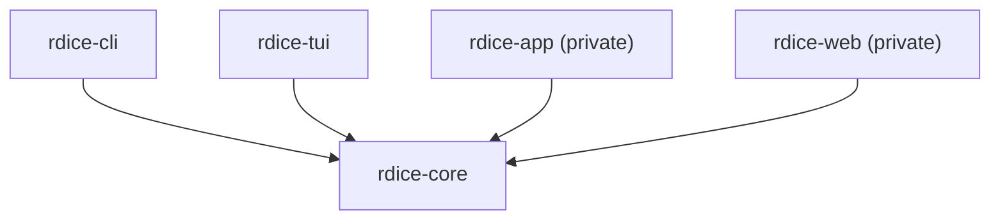

# Architecture

`rdice` keeps the public Rust projects in one workspace. The workspace is split
by product boundary rather than by technical layer.

## Public Workspace

```text
crates/
  rdice-core/  # reusable domain library
  rdice-cli/   # command-line interface
  rdice-tui/   # terminal UI
```

`rdice-core` is the dependency root. It should stay free of CLI, TUI, desktop,
web, filesystem, and process concerns. Its public API should focus on dice
definitions, trays, expression parsing, rolling, deterministic analysis, and
errors.

`rdice-cli` and `rdice-tui` may depend on `rdice-core`, but `rdice-core` must
not depend on either of them.



## Private Projects

Private application projects such as `rdice-app` and `rdice-web` should live in
separate private repositories. They should consume `rdice-core` from crates.io
for normal development, or from a pinned Git revision while integrating changes
that have not been released yet.

## Naming

- Cargo packages use kebab-case: `rdice-core`, `rdice-cli`, `rdice-tui`.
- Rust library crate names use snake_case: `rdice_core`, `rdice_tui`.
- User-facing binaries use concise names: `rdice`, `rdice-tui`.

## Versioning

Each package follows SemVer independently. Release lower-level dependencies
first:

1. `rdice-core`
2. `rdice-cli`
3. `rdice-tui`
4. private app and web projects

Use tags that include the package name, for example `rdice-core-v0.1.0`.
